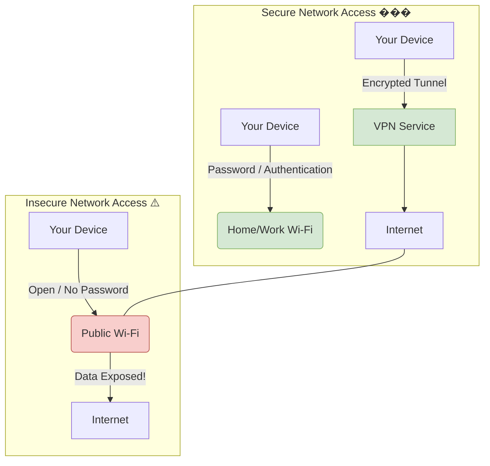

# Tutorial: Physical Network Access 

## What is Physical Network Access?

Physical network access means connecting your device to a network, like joining a Wi-Fi network at home or a coffee shop, or plugging into an Ethernet port. While connecting seems simple, it's important to understand the potential risks involved, especially on networks you don't control.

## Why is it Important?

Connecting to an unsecured network (like many free public Wi-Fi hotspots) can be risky. Others on the same network might be able to see the information your device sends and receives (like websites you visit or even login details), similar to eavesdropping on a conversation. This is called data interception.

## Best Practices for Network Security

Follow these guidelines to stay safer online:

*   **Use Secure Networks for Sensitive Tasks:** For activities like online banking, shopping, or accessing work email, always use a trusted, secure network. This usually means your home Wi-Fi (with a strong password!) or your mobile data connection.
*   **Be Cautious on Public Wi-Fi:** Avoid accessing sensitive accounts or information on public Wi-Fi networks. If you must use public Wi-Fi, consider using a Virtual Private Network (VPN). A VPN encrypts your connection, making it much harder for others to snoop on your activity.

## Visualizing Secure vs. Insecure Networks

---
*Next Up: Passwords and Policies*
---
[Next: Passwords](4_PASSWORDS.md)